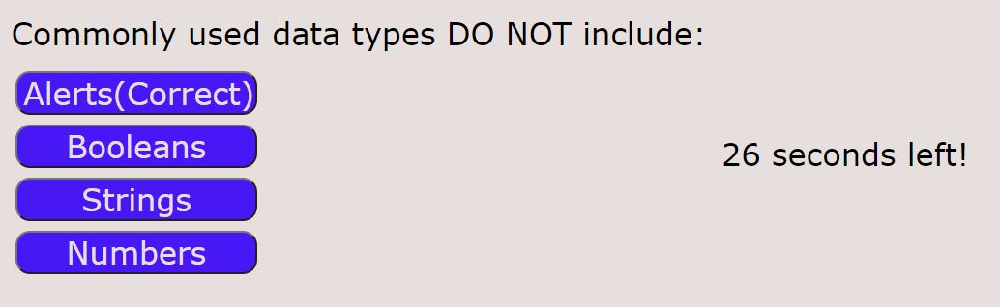

Assignment number four - coding quiz challenge.

I struggled with this one a bit, I was down to the wire so the styling is very lacking.

Includes quiz with timer, timer is deducted on wrong answer. Game ends on timer runout. Can enter high score at end, high scores are saved.

If I were to do this again I would redo my question logic entirely. I would also polish my styling much more.

https://lukert-uwa.github.io/Coding-Quiz/
